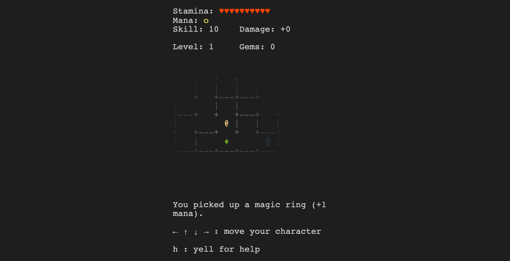

This tiny JavaScript game is a tribute to the 
[rogue-like](https://en.wikipedia.org/wiki/Roguelike) games. It relies on a *library* implementing a maze generator based on classical algorithms: binary tree, sidewinder and backtracker.

Try the live [demo](https://oliviernocent.github.io/rogue/).

---

Credits: [Etienne Coutant](https://iut-info.univ-reims.fr/users/coutant/Creation_Resolution_Labyrinthe_Sujet.html)
